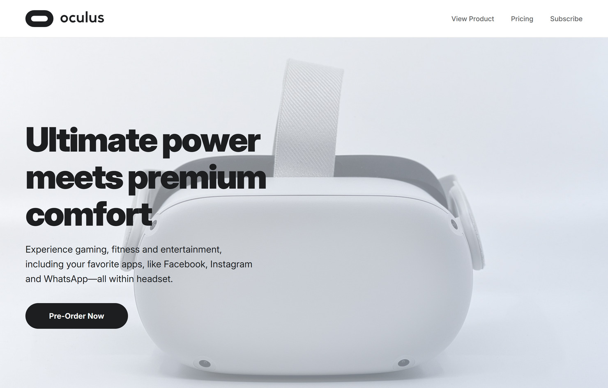

# Product Landing Page

## Preview



## Description

A simple product landing page dedicated to Oculus VR virtual reality headsets.

This project was built as part of the **["Product Landing Page"](https://www.freecodecamp.org/learn/2022/responsive-web-design/build-a-product-landing-page-project/build-a-product-landing-page)** assignment in the **[Legacy Responsive Web Design V8](https://www.freecodecamp.org/learn/2022/responsive-web-design/)** course on **[freeCodeCamp](https://www.freecodecamp.org/)**.

## Technologies Used

- HTML5
- CSS3
- Git & GitHub
- Command Line
- Visual Studio Code

## Project Structure

```
fcc-product-landing-page/
├─ README.md
├─ index.html
├─ css/
│  └─ styles.css
├─ assets/
│  └─ images/
│     └─ (other images...)
└─ preview.jpg
```

## Installation

1.  **Clone the repository**

    ```sh
    git clone https://github.com/yevgengvr/fcc-product-landing-page.git
    ```

2.  **Navigate to the project directory**
    ```sh
    cd fcc-product-landing-page
    ```

## Usage

Open the `index.html` file in your web browser. You can do this by double-clicking the file in your file explorer or by using your IDE's live server extension.

## Acknowledgments

- [freeCodeCamp](https://www.freecodecamp.org/) curriculum team
- Official [Meta Quest VR](https://www.meta.com/quest/) product page for design inspiration and text content
- Photo by <a href="https://unsplash.com/@mediamodifier?utm_source=unsplash&utm_medium=referral&utm_content=creditCopyText">Mediamodifier</a> on <a href="https://unsplash.com/photos/a-white-pot-with-a-black-handle-hwNVu64mgiE?utm_source=unsplash&utm_medium=referral&utm_content=creditCopyText">Unsplash</a>
- Photo by <a href="https://unsplash.com/@2hmedia?utm_source=unsplash&utm_medium=referral&utm_content=creditCopyText">2H Media</a> on <a href="https://unsplash.com/photos/a-pair-of-white-headphones-3I8KL_w3LuI?utm_source=unsplash&utm_medium=referral&utm_content=creditCopyText">Unsplash</a>

## Project Links

**[Live Preview](https://yevgengvr.github.io/fcc-product-landing-page/)** and **[Source](https://github.com/yevgengvr/fcc-product-landing-page)**.
